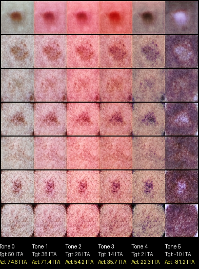

# Multi-Skin Tone Skin Lesion Generator

[](https://github.com/AVIRUPSahaAug/multi-skin-tone-skin-leision-dataset-generator)
[](https://www.python.org/downloads/release/python-3100/)
[](https://pytorch.org/)

## 🩺 Project Overview
This project aims to solve a critical problem in medical AI: **Dermatological Bias**. AI models used to detect skin cancer are often trained on datasets that lack diversity, leading to lower accuracy for patients with darker skin tones.

We built a **Fairness-Aware GAN** that solves this by generating realistic skin lesion images across a wide, controlled spectrum of skin tones. 

### 🖼️ Sample Generations

*A single generated lesion converted across 6 different skin tones without any structural deviation.*

---

## 🚀 The Novelty: How it Works
Unlike standard image generators that struggle with realism across different colors, this project implements several unique architectural features:

### 1. 🧬 Mathematical Skin Tone Tracking (ITA)
Instead of relying on a biased classifier to "guess" the skin color, we use the **Individual Typology Angle (ITA)**. This is a mathematical calculation that converts RGB pixels into clear color categories. Our GAN is trained to hit specific ITA targets, ensuring perfect skin tone control.

### 2. 🔗 Sobel Edge Mask Consistency
To ensure that a lesion looks the **exact same** across all skin tones, we use **Sobel Edge Detection**. The model creates a "physical map" of the lesion's shape and wrinkles. Our "Consistency Loss" forces this map to stay identical while the skin color changes, preventing the lesion from warping or blurring as it gets darker or lighter.

### 3. 🌊 Generative Cascade Architecture
We split the generator into two stages to ensure stability:
- **The Base Stage**: Learns to create one single, high-quality "Base Image" with perfect structure.
- **The Color Heads**: Six specialized U-Net heads take that base image and simply "paint" the skin tones on top without touching the clinical details of the lesion.

---

## 🎛️ Live Training Dashboard
The project includes a **Streamlit Dashboard** that allows researchers to monitor growth in real-time. You can adjust the "strength" of different losses (Adversarial, Tone accuracy, and Shape consistency) using live sliders without ever stopping the training process.

## 🛠️ Getting Started
1. **Environment**: Use the provided `../gpu` virtual environment.
2. **Launch Dashboard**:
   ```bash
   streamlit run dashboard.py
   ```
3. **Training**: Hit the **"Start Training"** button in the dashboard to begin generating diverse datasets!

---

### Key Highlights
- **6 Target Tones**: Spanning the Fitzpatrick scale from Very Light (50.0 ITA) to Dark (-10.0 ITA).
- **Fairness-First**: Specifically designed to create balanced medical datasets for more equitable AI.
